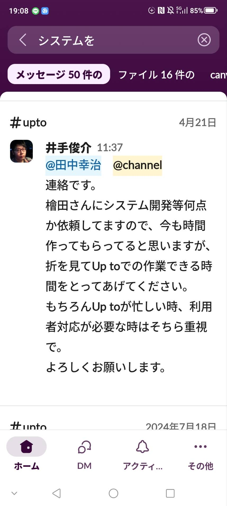

# NicoShift（ニコシフト） - 福祉施設向けシフト・運営支援システム

福祉施設向けのシフト管理SaaS。Laravel + Vue + FullCalendar によって構築された、実務現場を意識したWebアプリです。

---

## 📚 目次

- [❓ なぜこのシステムを作ったのか](#-なぜこのシステムを作ったのか)
- [💡 解決したかった課題](#-解決したかった課題)
- [🧠 ビジネス的視点からの差別化ポイント](#-ビジネス的視点からの差別化ポイント)
- [🚀 今後の展望](#-今後の展望)
- [✅ こんな方におすすめ](#-こんな方におすすめ)
- [⚠️ 高機能＝満足とは限らないと気づいた出来事](#-高機能満足とは限らないと気づいた出来事)
- [💥 システム導入の現場あるある（リアル）](#-システム導入の現場あるあるリアル)
- [🧑‍💼 エンジニアとしての違和感と確信](#-エンジニアとしての違和感と確信)
- [🎯 だからこそ作るべきサービスが見えた](#-だからこそ作るべきサービスが見えた)
- [🏢 実際の現場での評価と導入](#-実際の現場での評価と導入)
- [🤝 今後の予定](#-今後の予定-1)

---

### 👇 以下、プロダクト仕様部分

- [🌈 NicoShift（ニコシフト）](#-nicoshiftニコシフト)
- [👤 想定ユーザー](#-想定ユーザー)
- [🔐 ユーザー認証・権限管理](#-ユーザー認証権限管理)
- [📦 機能一覧（2025年5月13日時点）](#-機能一覧2025年5月13日時点)
  - [👤 職員向け](#-職員向け)
  - [👨‍💼 管理者向け](#-管理者向け)
- [📅 今後の予定（機能）](#-今後の予定機能)
- [📦 機能設計の特徴](#-機能設計の特徴)
- [🛠 実装優先度（MVP）](#-実装優先度mvp)
- [📌 運用想定](#-運用想定)
- [💡 導入効果](#-導入効果)
- [🚀 今後の予定（CI/CDやスマホ対応）](#-今後の予定cicdやスマホ対応)
- [🧰 使用技術](#-使用技術)
- [📥 セットアップ方法（ローカル開発用）](#-セットアップ方法ローカル開発用)
- [📂 ディレクトリ構成](#-ディレクトリ構成)


## ❓ なぜこのシステムを作ったのか

私は福祉施設で実際に現場勤務をしながら、  
多くの施設が「手書きやExcelベース」で煩雑なシフト作成や勤怠管理、申し送りに追われている現状を目の当たりにしました。

また、既存の福祉業界向けシステム（例：プロジェクトRIN、know Be等）は機能が豊富である一方、  
「操作が複雑すぎて現場では使われていない」ケースが多く、  
導入しても紙に戻ってしまう、という“導入失敗”が頻発していました。

---

## 💡 解決したかった課題

- **現場スタッフのITリテラシーの壁**  
  → シンプルで直感的な操作、マニュアル不要を目指す

- **少人数運営の限界**  
  → 勤怠・シフト・日報・申し送りを最小限の負担で回せる構成

- **高すぎる導入コスト**  
  → 小規模法人でも導入しやすい価格帯・補助金活用も前提に設計

---

## 🧠 ビジネス的視点からの差別化ポイント

- **グループホーム特化の軽量SaaS**  
  → 需要が高く、IT未整備な業態に絞り込み

- **営業担当はサービス管理責任者資格者（サビ管）**  
  → 現場経験者による信頼性の高い導入支援体制

- **補助金申請マニュアル付き導入プラン**  
  → IT導入補助金・業務改善助成金などで導入障壁を極限まで下げる

- **現役の福祉施設法人社長に評価され、準委任契約を獲得**  
  → 実案件としてプロトタイプ活用・評価済み

---

## 🚀 今後の展望

- 「少人数で複数棟運営を支援する」モジュール開発（勤怠→加算→支援記録）  
- 「現場スタッフが“使える”ことを最優先」したUI改良  
- 年間10法人導入 × 月額1.5万円 × ストック収益モデルの構築  
- SaaS×補助金支援という導入ハイブリッドモデルでスケール可能

---

## ✅ こんな方におすすめ

- 小規模〜中規模の福祉法人で、紙管理から脱却したい方  
- RIN等の既存システムが「現場で使われない」と感じている方  
- グループホームを複数棟運営したいが、管理者が足りない方  
- システム導入に補助金を使いたいが、やり方がわからない方


---

## ⚠️ 高機能＝満足とは限らないと気づいた出来事

当初私は、「これだけ高機能な既存システムが販売されているのなら、  
いまさら個人開発でSaaSを作っても厳しいのではないか」と感じていました。

実際、私の勤める福祉施設でも、既に know be からプロジェクトRINへの移行が進んでいました。

「せっかくなので今後の開発の参考にしたい」と思い、私は管理者にこう聞きました。

> **私：「この機能すごいですね！使い方教えてもらえますか？」**  
> **管理者：「いや…実際ここしか使ってないんだよね。マニュアルも分厚くて読む気しないし。」**

このとき、私は衝撃を受けました。  
**「現場は高機能を望んでいない」**こと、そして  
**「経営陣と現場で意識がまったくズレている」**ことに気づいたのです。

---

### 💥 システム導入の現場あるある（リアル）

| 経営陣の視点                       | 現場の実情                             |
|----------------------------------|--------------------------------------|
| 「このシステム、何でもできるぞ」       | 「多すぎてどこ押せばいいか分からない…」        |
| 「マニュアルあるし、後で見れば分かる」 | 「分厚すぎて読む気にならない。とりあえず紙で作るか…」 |
| 「導入で効率化したのに何で時間変わらないの？」 | 「結局、手作業の方が早い気がする…」             |

**高機能 = 満足ではない。**  
これは現場にいたからこそ、リアルに理解できた実感です。

---

## 🧑‍💼 エンジニアとしての違和感と確信

私自身、福祉業界のIT環境の“想像以上の低さ”に驚きました。

- Excelですら苦戦する職員が多く存在する  
- 管理者クラスですら、日報・申し送りを手書き・手集計  
- Excel作業のために**土日に出勤する管理者**もいる現実

「すでにシステムが導入されている」ことと、  
「現場に本当に使われている」ことは**全く別問題**だったのです。

---

## 🎯 だからこそ作るべきサービスが見えた

> **「未導入」ではなく「未満足」が市場。**  
>  
> 本当に求められているのは、  
> **“ちょうどいい機能を、ちょうどよく使える”**システム。

NicoShiftは、「エンジニア目線」でも「現場目線」でも、  
そのギャップを埋めることを最優先に設計しています。

特にグループホーム（GH）は、福祉事業の中でも利益率が高く、参入障壁が低いため、  
**新規法人・小規模法人が最もシステム支援を必要としているゾーンです。**

この「ずれ」を狙い撃ちすること。  
それが私のSaaS戦略であり、**NicoShiftが生まれた根拠そのものです。**

---

## 🏢 実際の現場での評価と導入

この考えは、私が勤めている福祉施設の社長にも共感していただき、  
現在、社内で実際にこのシステム（NicoShift）を開発・導入する方向で動いています。

Slackでも以下のように、社長から他職員へ  
「システム開発の時間を確保してほしい」と声掛けをいただきました：

📸 ![Slack証拠]
<p align="center">
  
</p>

このように、**ただの個人開発ではなく、“実在する法人の課題解決プロジェクト”として認知・支援されている点が、他のポートフォリオとの大きな違い**です。

---

## 🤝 今後の予定

2025年6月以降は、現職法人との**週2回程度の準委任契約として継続開発に関わる予定**です。  
技術的なアウトプットだけでなく、**現場導入・ヒアリング・要望反映・マニュアル作成・運用支援**までを含めた、  
**“実装後まで見据えたシステム開発者”として継続的に信頼を得ています。

---

---

---

# 🌈 NicoShift（ニコシフト）

福祉施設向けシフト管理アプリ  
NicoShiftは、福祉施設のシフト業務を効率化するLaravel製のWebアプリです。
開発：Laravel 11 + Vue.js（FullCalendar, Alpine.js 他）  
テスト版リリース予定：**2025年5月19日**

---

## 👤 想定ユーザー

| ロール | 主な機能 |
|--------|-----------|
| 職員（スタッフ） | 自分のシフト希望申請、確定シフト確認 |
| 管理者（マネージャー） | シフト作成・管理、勤怠確認、職員登録、設定 |

---

## 🔐 ユーザー認証・権限管理

- Laravel Breeze によるログイン/ログアウト機能
- ユーザー登録は管理者のみが可能（メール＋仮パスワード）
- `is_admin` フラグにより職員/管理者の画面・機能を切り分け
---

## 📦 機能一覧（2025年5月13日時点）

### 👤 職員向け

| 機能名 | 内容 | 状況 |
|--------|------|------|
| シフト希望申請 | カレンダー上で勤務タイプを選択、非同期に保持し「申請」ボタンで一括登録 | ✅ 実装済み |
| シフト希望の削除・変更 | カレンダー上の希望を個別に取り消し・再編集可能に | 🚧 一部対応中 |
| 希望シフトの締切制御 | 月別の申請締切日をDBで管理し、期限超過時は申請不可 | ✅ 実装済み |
| 締切オーバーのUI制御 | ボタン非活性・グレーアウトで締切を超えた申請を防止 | ✅ 実装済み |
| 自分の確定シフト確認 | FullCalendarでの月別表示（DB連携） | ✅ 実装済み |
| 過去の申請履歴確認 | 過去データは別テーブルから取得・表示 | ✅ 実装済み |

---

### 👨‍💼 管理者向け

| 機能名 | 内容 | 状況 |
|--------|------|------|
| 希望シフト一覧表示 | 全職員の希望を一覧で確認、未提出者も確認可能 | ✅ 実装済み |
| シフト作成（確定） | FullCalendarで非同期入力、確定ボタンで一括DB保存 | 🚧 UI完成・登録調整中 |
| モーダル勤務登録 | カレンダークリックでモーダル選択（職員・勤務種別） | ✅ 実装済み |
| 夜勤シフト表作成 | 表形式で登録、非同期で追加・削除可能 | ✅ 実装済み |
| 夜勤：職員名表示 | セル内に user_id でなく名前を表示 | ✅ 対応済み |
| 夜勤：ステータス制御 | 登録後の状態をステータスで切り替え | 🚧 実装中 |
| 固定シフト登録 | 週×曜日のJSON形式で個別登録、下部フォームあり | ✅ 実装済み |
| 固定シフトの表示UI | 表形式で視認性よく一覧表示 | ✅ 実装済み |
| 勤怠実績との照合 | Recoru API連携で予定 vs 実績を比較 | ❌ 未実装 |
| 職員管理 | 職員追加・編集・削除（部署・役職対応） | ✅ 実装済み |
| 管理画面ルーティング制御 | `is_admin` による制御 | ✅ 実装済み |
| 勤務種別管理 | 勤務タイプの登録・更新 | ✅ 実装済み |
| 締切設定画面 | 月ごとの締切日を登録・編集可能 | ✅ 実装済み |
| 通知機能（メール） | シフト申請開始・確定通知など | ❌ 未実装 |
| CSV出力機能 | 勤務者集計や出勤実績の出力 | ❌ 未実装 |
| PDF出力（確定シフト） | 印刷用のシフト出力対応 | ❌ 未実装 |

---

## 📅 今後の予定

- [ ] Recoru API連携（勤怠実績取り込み）
- [ ] 通知機能の追加（申請開始通知、確定通知など）
- [ ] CSV出力／PDF出力対応（勤怠集計や印刷用シフト表）
- [ ] スマホUI最適化（最低限の閲覧・申請機能に対応）
- [ ] Render/AWSによるCI/CD構築およびデモ環境公開

---

## 📦 機能設計の特徴

- 大量データ対応を考慮した設計（ユーザー数60名想定）
- ロール別で表示内容・編集内容を分岐
- 「下書き → 確定 → 通知」などワークフロー型の運用が可能
- JSON形式を活用し、複雑な週間パターンや複数勤務種別に柔軟対応
- 今後のSaaS展開や補助金申請も想定した構成

---

## 🛠 実装優先度（MVP）

1. Laravelプロジェクト作成＋ログイン機能（Breeze）
2. シフトDB設計＆マイグレーション
3. 職員向け：自分のシフト表示画面
4. 管理者向け：月間シフト入力画面
5. シンプルなUI調整（Tailwind）
6. PDF出力機能（余裕があれば）

---

## 📌 運用想定

| ユーザー | 操作内容 |
|---------|----------|
| 職員 | 自分のシフトをスマホで確認 |
| 管理者 | 月末に翌月のシフトを作成＆保存＋PDFで配布 |
| 管理者 | 必要に応じて職員の追加・編集 |

---

## 💡 導入効果

- 紙やLINE配布から脱却し、修正も即時反映
- 確認ミスや更新漏れの削減

---

## 🚀 今後の予定

- [ ] Recoru APIとの連携（勤務実績データ）
- [ ] 確定シフトのPDF出力・通知
- [ ] 勤務者集計レポート・CSV出力
- [ ] SaaS版 Render/AWS 上での CI/CD 展開
- [ ] スマホ版UI（最低限の閲覧＋申請）

---

## 🧰 使用技術

- **PHP**: バックエンドのフレームワークとして使用
- **Laravel**: 高速なWebアプリケーション開発を実現するために使用
  - **Laravel Breeze**: 認証機能（ログイン/ログアウト、ユーザー登録）を実装
  - **Eloquent ORM**: データベースとのやり取りを簡単に実現
- **MySQL**: データベースとして使用（シフト情報などの保存）
- **Tailwind CSS**: シンプルで美しいレスポンシブデザインを提供
- **JavaScript**: フロントエンドのインタラクション（FullCalendarなど）
- **FullCalendar**: シフト表示やカレンダー機能を提供
- **barryvdh/laravel-dompdf**: PDF出力（オプション）

---


## セットアップ方法（ローカル開発用）

```bash
# 1. リポジトリをクローン
git clone https://github.com/ユーザー名/nico.git
cd nico

# 2. 依存関係をインストール
composer install
npm install

# 3. 環境設定
cp .env.example .env
php artisan key:generate

# 4. DB接続情報を .env に記載

# 5. マイグレーションとシーディング（必要なら）
php artisan migrate --seed

# 6. サーバー起動
php artisan serve
これで、http://localhost:8000 でアプリケーションにアクセスできます。

## 📂 ディレクトリ構成

nico-shift-app/
├── app/ # アプリケーションのソースコード
│ ├── Http/ # コントローラやリクエストの処理
│ ├── Models/ # Eloquentモデル
├── resources/ # フロントエンドのリソース
│ ├── js/ # JavaScriptファイル
│ ├── sass/ # SCSS（TailwindCSS設定）
│ └── views/ # Bladeテンプレート
├── routes/ # アプリケーションのルーティング
│ └── web.php # HTTPルート設定
├── storage/ # アプリケーションのログやキャッシュ
├── tests/ # テストコード
├── .env # 環境設定ファイル
├── artisan # Laravelコマンドラインツール
├── composer.json # Composer設定ファイル
├── package.json # npm設定ファイル
└── README.md # プロジェクトの仕様書


